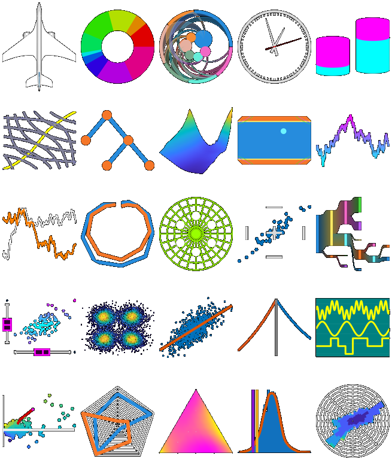

# Chart Examples

This toolbox contains the MATLAB® code and examples for the technical article [_Creating Specialized Charts with MATLAB Object-Oriented Programming_](https://www.mathworks.com/company/newsletters/articles/creating-specialized-charts-with-matlab-object-oriented-programming.html).

A chart provides a task-specific application programming interface (API) for creating custom visualizations. Designing and implementing a chart not only provides a convenient API for end users, but simultaneously removes the need for the user to manipulate low-level graphics objects.

The toolbox comprises several diverse examples of custom MATLAB charts, together with an app for browsing the available charts and their documentation.

You can inspect the source code, explore the features and functionality, and run examples demonstrating the use of each chart. The toolbox also has documentation and resources to help you develop your own charts.

## Installation and Getting Started
This submission is a MATLAB toolbox.
1. Double-click on the toolbox installer (the `.mltbx` file) to install the toolbox.
2. See the `GettingStarted.mlx` guide for introductory information.
3. Open the `Chart Browser` app from the Apps gallery to access further documentation resources and view the example charts.

## [MathWorks](https://www.mathworks.com) Product Requirements

This toolbox requires MATLAB release R2024b or later.
- [MATLAB](https://www.mathworks.com/products/matlab.html)

Some example charts in the toolbox rely on additional toolboxes.

## License
The license is available in the [LICENSE.txt](LICENSE.txt) file in this GitHub repository.

_Copyright 2018-2025 The MathWorks, Inc._